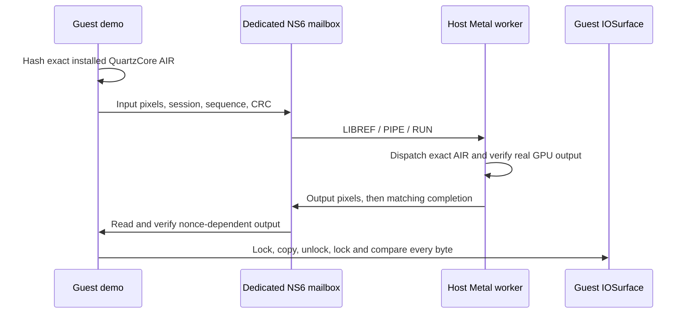

# Guest-requested host Metal IOSurface demo (24A5430a)

## Scope

This adds an opt-in guest program, `guest_surface_demo.m`, and its host
mailbox peer, `surface_peer.py`. Host Metal returns three nonce-dependent
results over NS6; the guest copies each into a guest-owned 64×48 BGRA
IOSurface and reads it back. The existing
`read_write_surf_compute` shader copies the supplied texture. This is a
functional offscreen forwarding experiment, not a system Metal driver or a
performance win. SpringBoard still uses the existing software rendering path.
No DCP/IOMFB/compositor adoption of the demo surface or iOS GPU-device
exposure occurs.



No console input reader is replaced. The one-shot helper is added to the
cached launchd dictionary; all 735 existing services remain unchanged. The
host owns one disposable 64 MiB raw NS6 backend. The guest opens the exact
`AppleANS3CGv2Controller/NS_06` path, verifies class and 4096×16384 capacity,
then verifies the session header and AIR digest before writing anything.
System/Data are never mounted on the host. Installation uses a copied small
restore ramdisk and a disposable child of the migrated disk.

## Pinned baseline

The project branch `codex/gpu-surface-demo` merges main `60628ac` at
`2bc80f3`. The QEMU branch `codex/gpu-surface-demo-qemu` merges main
`b0f7bc6` at `20b3d3e`, retaining the auxiliary namespace migration blocker
and trace experiments. The ANS merge conflict retained both the auxiliary
pre-load guard and main's SART power subsection.

QEMU was rebuilt with `ninja -C build -j 8 qemu-system-aarch64`, then copied
to `/tmp/dvm/GPU_DEMO_QEMU1/qemu-system-aarch64` before any boot. SHA-256:
`a75bdb896acc20d9fac07689435dca725575af54f88629183ed0fa1135797e3b`.
The build has PV graphics disabled. No running VM uses the rebuilt file in
place, and no unrelated VM was stopped or modified.

| Input | Preserved or selected artifact |
|---|---|
| Guest | iOS 27 24A5430a, iPhone17,3/T8140 |
| Migrated parent | `/tmp/dvm/NATIVE_HID_INSTALL8/disk.qcow2`, SHA `da06b8bad80ed71127b77d4aca0e1f51dd881fd128c89ff4b4afa1b385ce03d6` |
| Native RTC kernel | `/tmp/dvm/DISPLAY_SMP6.bootkc`, SHA `da1e254ab81e31adae87c049da295b582dabbd4ba46096fc58f3e5467fc6e02c` |
| Native SPMI tree | `/tmp/dvm/RTC_NATIVE1/dt_spmi_system.bin`, SHA `172805b97889b6b4259f4cd44ea39c5bba591a6299e15cf633502391a2fe4430` |
| NS6 tree | `/tmp/dvm/GPU_DEMO_QEMU1/aux.dtree`, SHA `af2c13e0cea7427fbe2b0740b09486e8c60885c29f381245fadd95513b032950` |
| HID v12 trust cache | `/tmp/dvm/native-hid-v12/system.tc`, SHA `40d687cffa22b881a49ba856cee7f9421a2344fc94c94b4c8933b677f62c076d` |
| Cached launchd source | `/tmp/dvm/native-services6/launchd.plist`, SHA `f25de1647f2957b20c2e4f2898b999351b87d323879899d019bb1db206d1d7d2` |
| SPTM | SHA `b0fd274d3009ccfbc9902e99ef441a2231fb852931f8b31233e9bc0f55207048` |
| TXM | SHA `b8617cfca055a03711247ad9652f3cfdb026889dcca2eb1436496df4cb61a398` |

The aux tree adds only `(8,6,0)` to the native tree's ANS namespace list;
`dtree.json` records the byte-for-byte check of every unrelated property.
The system boots use `DARWIN_RTC_PV=0`, native SPMI/PMU RTC, SMP-only kernel
patches, six TCG CPUs, native `DARWIN_INPUT_UART=1`, and the inherited DCP
configuration. This combines the independently tested native RTC and HID
inputs without reverting to the older RTC-patched kernel. The normal SPTM,
TXM, activation and migrated Data lineage remain in the manifests.

## Contract and verification

The guest selects and hashes the installed QuartzCore AIR slice itself:
2,705,796 bytes, SHA
`8860e4a17d89783da06429a302db0bc61b2939963f202c0c6ad31189a1021364`.
The host requires the identical cached slice. `LIBREF` avoids uploading the
same 2.7 MiB each boot. Neither side authors a substitute shader.

Mailbox offsets are header `0`, request `0x10000`, reply `0x20000`, input
`0x100000`, output `0x200000`. All guest I/O is aligned and in range. The
request contains a random session identity, sequence, guest nonce, byte
count and CRC. Input is published before the request. Host output is
published before its completion; the guest validates both packet CRC and
all 12,288 output bytes. Duplicate valid requests do not dispatch twice.
Only one submission is outstanding, so input/output ownership is explicit.

The unchanged host `metal_proxy_server.m` creates the library and pipeline,
poisons its output before dispatch, waits for completed Metal status 4, and
checks texture readback against host IOSurface readback and supplied input.
The guest then copies verified output into its own locked IOSurface and
independently locks/readbacks that surface. The runner binds each guest
AIR/nonce/sequence/CRC witness to its matching host record, and requires a
clean host-worker exit before passing.

A missing reply gets a 30-second guest polling budget and an explicit CPU
copy fallback. Fallback cannot satisfy the GPU pass condition and the
session is discarded after timeout. This new demo’s injected-timeout fallback
branch has not been run; the normal path verifies its separate CPU reference.
Synchronous kernel calls can themselves
stall; the owned host runner has a 450-second total VM deadline and tears
down its process. CPU rendering for the rest of iOS is unchanged. Normal
successful runs also exercise and verify a separate CPU copy reference;
that is not a representative CPU-rendering benchmark.

The guest is ad-hoc signed and added to the trust cache with
`platform-application`, `com.apple.AppleNVMeNamespaceDevice.allow`, and
IOKit class exceptions for `AppleNVMeNamespaceUC` and
`IOSurfaceRootUserClient`. This is executable loading on this development
guest; no system Metal plugin discovery/registration claim follows.

## Experiments and failures

`GPU_DEMO_HOST1` and the opt-in real Metal unittest both passed three
simulated-guest mailbox submissions. They establish the host peer, shader,
CRC, duplicate rejection and output protocol, not guest execution.

`GPU_DEMO_RUN1` used three allocate/submit/destroy cycles. It observed two
complete guest surface oracles:

| Sequence | Guest CRC | Guest reported total | Host Metal GPU duration |
|---|---|---:|---:|
| 1 | `5661d550` | 212.900 ms | 0.033 ms |
| 2 | `978cb562` | 2020.060 ms | 0.161 ms |

No third submission followed. A read-only saved-stack snapshot found the
helper in `_iokit_user_client_trap+8`, with callers
`IOSurfaceClientRelease+268` and `-[IOSurface dealloc]+48` (cache slide
`0x13008000`). This is observed saved-state evidence plus exact-cache symbol
attribution, not proof of a general IOSurface deadlock or its kernel cause.
The parent stopped this diagnostic after preserving the evidence; the run
has no overall pass. The native lockscreen remained visible and HID pings
continued. The snapshot paused only this VM for 2.769 seconds; its complete
run is not an undisturbed latency benchmark.

`GPU_DEMO_RUN2` retained one surface across submissions. Host Metal completed
sequence 1, but its guest result line never arrived. Its read-only snapshot
showed `_os_unfair_lock_lock_with_options+12`, `_pthread_key_init_np+52`,
`__Balloc_D2A`, `__d2b_D2A`, `__dtoa`, and `fprintf`. Disassembly maps the
helper return address to the floating-point result-log call, after the
surface comparison. Thus the observed failure is in diagnostic reporting;
we do not count an absent guest completion marker as a pass. This trial was
stopped and the final helper reports integer microseconds, avoiding that
formatting path. The cause of the pthread lock stall remains unresolved.

The default helper now uses one persistent surface for three submissions,
with a single explicit release afterward. `build_surface_demo.sh --recreate`
retains the allocate/destroy variant for further diagnosis.

`GPU_DEMO_RUN3` used the final integer-logging helper and one persistent
IOSurface (ID 2). All three guest submissions, exact GPU byte comparisons,
locked guest IOSurface readbacks and the final surface release completed.
The guest's final pass marker arrived 18.602 host seconds after QEMU start.

| Sequence | Nonce | Verified guest CRC | Guest total | Host service | Host GPU duration |
|---|---:|---|---:|---:|---:|
| 1 | 2647391604 | `25c07f7e` | 176.741 ms | 163.551 ms | 0.022 ms |
| 2 | 3783018759 | `9039f8a8` | 14.569 ms | 1.899 ms | 0.014 ms |
| 3 | 378946629 | `b18bccf5` | 8.485 ms | 1.647 ms | 0.014 ms |

The first request includes host library/pipeline setup. Guest totals stay
within the guest monotonic clock; host service and Metal timestamps stay
within their host domains. No guest/host clock origins are subtracted.
These are three early-boot observations, not a settled latency distribution,
a frame-rate claim, or a GPU-versus-CPU benchmark. The 12 KiB CPU copies were
932, 5 and 28 microseconds; this tiny copy workload is slower via the GPU
round trip. Its role is verification, not useful acceleration by itself.

The complete host runner passed and reaped its QEMU at 142.047 seconds.
After GPU completion, native presentation count rose from 0 to 1 at
141.803 seconds. A subsequent native-input ping (epoch 2, sequence 61,
issued after the completion-time next-sequence baseline of 3) received a
`Q R` acknowledgment at 140.430 seconds. There were no `panic(cpu` markers.
Two input timeouts occurred before helper readiness; the successful later
ping does not erase those early counters. No touch gesture was injected.

`GPU_DEMO_RUN3/final.png` is the first, very dark transition frame, not a
settled home screen. RUN1's later screenshot shows the legible native
lockscreen. Neither screenshot displays the demo surface. The final run
used no RAM restore, debugger, memory patch or diagnostic pause.

| Route/contract | Assessment |
|---|---|
| Exact guest shader → real host Metal → guest-owned IOSurface | **Proven**, three nonce-dependent submissions in RUN3, including final guest surface release |
| Native display and input reader continue independently | **Proven within scope**: later presentation and fresh ready-state ping ACK; no demo adoption or gesture claim |
| Three immediate guest allocate/destroy cycles | **Disproven within RUN1's bounded diagnostic scope**: two results followed by prolonged lack of progress, saved stack in release; general lifetime support remains unresolved |
| Copy offload is faster than the CPU copy | **Disproven for these three observations**; not a representative rendering benchmark |
| Automatic Metal discovery, compositor adoption, adapted Apple PV, interception, Windows host execution | **Untested by this implementation** |
| Live GPU/mailbox checkpoint restore | **Untested and intentionally blocked** by the auxiliary migration guard |

Validation passed 68 project host tests, three mailbox tests including real
Metal execution, shell syntax and exact-guest import/codesign checks. Two
Terra/high read-only reviews checked baseline inheritance, protocol/evidence
gates and scope; the parent reviewed and tightened their findings.

## Evidence archive

Small records, source copies, symbol attribution, signed-build metadata,
input/output BGRA bytes, final mailbox pages and screenshots are preserved
under `/Users/jdolbe1/dvm-artifacts/research/gpu-surface-ios27-20260905`.
`index.json` records source paths and SHA-256 hashes. Executables, Apple
shader libraries, RAM dumps and disk images remain in the named local
experiment directories and are excluded from this archive. Full raw
mailboxes remain local; `mailbox-final.json` preserves their final pages and
whole-file hashes. `GPU_DEMO_QEMU1/baseline-after.json` records post-run
verification of the original backing chain and pinned inputs.

## Reproduction

From the isolated project checkout, build and stage fresh paths:

```sh
bash tools/gpu/build_surface_demo.sh /tmp/dvm/GPU_DEMO_BUILD8
python3 tools/gpu/prepare_guest_load.py \
  --build /tmp/dvm/GPU_DEMO_BUILD8 \
  --cache /tmp/dvm/native-services6/launchd.plist \
  --system-tc /tmp/dvm/native-hid-v12/system.tc \
  --output /tmp/dvm/GPU_DEMO_STAGE5 --interactive-load
python3 tools/gpu/run_guest_install.py \
  --manifest /tmp/dvm/GPU_DEMO_QEMU1/native-manifest.json \
  --stage /tmp/dvm/GPU_DEMO_STAGE5 --tag GPU_DEMO_INSTALL3
python3 tools/gpu/prepare_aux_manifest.py \
  /tmp/dvm/GPU_DEMO_INSTALL3/warm-manifest.json \
  /tmp/dvm/GPU_DEMO_QEMU1/qemu-system-aarch64 \
  /tmp/dvm/GPU_DEMO_QEMU1/aux.dtree \
  /tmp/dvm/GPU_DEMO_QEMU1/surface3-manifest.json
python3 tools/gpu/run_guest_load.py \
  /tmp/dvm/GPU_DEMO_QEMU1/surface3-manifest.json \
  --tag GPU_DEMO_RUN3 --seconds 450 \
  --surface-worker /tmp/dvm/GPU_DEMO_BUILD8/metal_proxy_server \
  --library-cache /tmp/dvm/GPU_FEAS_SHADER1/air/slice0.metallib \
  --aux-poll-ms 1 --surface-observe-display
```

These are the recorded artifact names; use new names for a rerun. The pinned
native manifest derives from `/tmp/dvm/native-hid-v12/warm-manifest.json`,
replacing only QEMU, BootKC and tree with the table above and setting
`DARWIN_RTC_PV=0`. Never directly execute an inherited warm manifest's argv:
the runner removes old RAM restore, debugger, paused-start and socket
arguments and creates a fresh child. Actual fresh argv/env are in each
run's `launch.json`.

Validation commands:

```sh
python3 -m unittest discover -s tools/tests -v
DVM_SURFACE_WORKER=/tmp/dvm/GPU_DEMO_BUILD8/metal_proxy_server \
DVM_SURFACE_AIR=/tmp/dvm/GPU_FEAS_SHADER1/air/slice0.metallib \
  python3 -m unittest discover -s tools/gpu -p test_surface_peer.py -v
bash -n tools/gpu/build_surface_demo.sh tools/probe.sh \
  tools/re/setup_gate_probe.sh tools/re/setup_gate_sweep.sh
```

## Limits and next implementation

- Offscreen forwarded execution is assessed separately from presentation.
  The demo's new IOSurface has not been adopted by the compositor. Native
  lockscreen images and presentation counters witness the existing display,
  not display of the demo pixels.
- The optional native observation gate requires a new presentation after
  GPU completion and a subsequently issued DVMI2 ping's ready-state ACK.
  A ping tests the reader/transport, not touch dispatch or a visible gesture.
- The copy workload cannot justify accelerating iOS rendering: transfer,
  scheduling, copies, surface APIs and logging dominate its tiny GPU work.
  CPU/GPU choice must remain opt-in until a representative expensive shader
  beats the CPU path end to end in a settled guest.
- Auxiliary namespace save/restore remains blocked. No live Metal resource,
  mailbox, outstanding completion or persistent surface checkpoint claim is
  made. Host handles would need recreation and an explicit quiesce protocol.
- Repeated surface destruction and the formatting-lock issue remain
  independent unresolved contracts. A successful persistent-surface run
  would not establish a general resource allocator/lifetime implementation.

The smallest follow-on is to also reuse the host textures (this peer still
recreates them per sequence), keep the guest surface and pipeline alive, gate work
on a settled native display, and run a representative more expensive exact
QuartzCore shader with explicit parameters and a verified CPU reference.
Presentation adoption, system Metal registration and checkpoint state should
have separate gates; none can be inferred from this mailbox demo.
